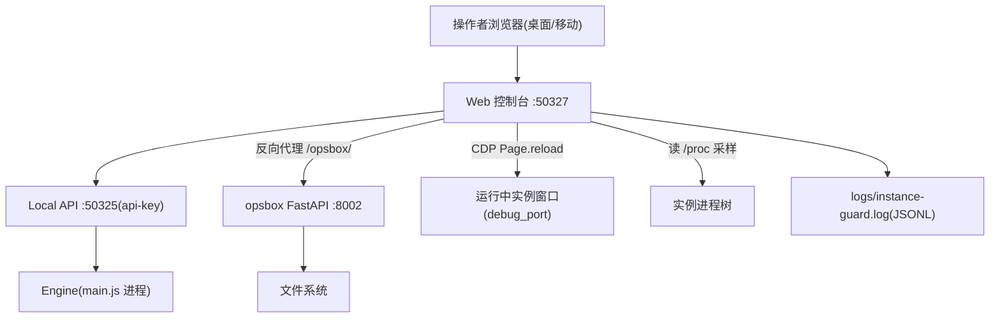

# 技术设计：OpenBrowser Web 可视化控制台与运维集成

Feature Name: openbrowser-web-console
Updated: 2026-10-04

## Description

在 Browserapp 内新增零依赖 Node.js Web 控制台（`webconsole/`），对外暴露单端口 50327；控制台向前调用 OpenBrowser Local API（50325, api-key），向后反向代理 opsbox（8002）。控制台内置刷新调度器（CDP）、实例资源守护、口令登录。移动端优先的响应式 UI。

## Architecture



- 单端口约束：预览环境只暴露一个端口，控制台作为唯一入口，`/opsbox/*` 由控制台 HTTP 转发到 127.0.0.1:8002。
- 零依赖：沿用仓库无运行时依赖风格，控制台用 `node:http` 实现；CDP 用 Node 22 内置全局 `WebSocket`。
- opsbox 以独立 Python 进程运行（vendored 到仓库 `opsbox/` 目录），与控制台解耦，崩溃不影响实例管理。

## Components and Interfaces

### 1. `webconsole/server.js` — HTTP 服务

| 路由 | 说明 |
| --- | --- |
| `GET /` | 控制台 SPA（登录页 + 主界面） |
| `POST /api/console/login` | 口令换 HMAC token（复用 opsbox 的 `exp.hmac(secret)` 方案） |
| `GET /api/console/profiles` | 聚合 Local API `user/list` + `browser/active` + 刷新配置 + 守护状态 |
| `GET /api/console/profiles/:id` | 实例详情（含指纹摘要） |
| `POST /api/console/profiles/:id` | 更新实例（转发 Local API `browser-profile/update`） |
| `POST /api/console/profiles/:id/random-fingerprint` | 生成随机人设并保存（`?restart=1` 时启停重启） |
| `POST /api/console/profiles/:id/start` `stop` | 启停实例（转发 Local API） |
| `GET/PUT /api/console/profiles/:id/refresh` | 读写窗口级刷新配置 |
| `GET /api/console/guard` `PUT /api/console/guard` | 读取/修改守护阈值配置 |
| `GET /api/console/guard/events` | 最近守护事件（读 JSONL 尾部） |
| `ANY /opsbox/*` | 反向代理到 127.0.0.1:8002（透传 header/query/body，流式转发） |

认证：除 `login`、`/opsbox/` 静态首页代理外全部要求 `x-console-token`（header 或 cookie）。Local API api-key 从 `<userData>/local-api-key.txt` 读取（uid 1000 环境：`/home/openbrowser/.config/openbrowser/local-api-key.txt`）。

口令：不写入仓库，优先环境变量 `CONSOLE_PASSWORD`，其次 `<userData>/console-password.txt`，控制台与 opsbox 共用（opsbox 侧同样读取该文件，或用 `OPS_PASSWORD` 覆盖）。

### 2. `webconsole/fingerprint.js` — 随机人设生成

- 输出与 Local API `profiles/update` 字段对齐的对象：`os/platform`、`userAgent`（含 UA-CH 一致性）、`windowSize/resolution`、`timezone`、`languageCode/locale`、`webglVendor/webglRenderer`（从真实厂商-渲染器配对表中抽取）、`hardwareConcurrency`、`deviceMemory`、`privacy.fingerprint`（Canvas/WebGL/AudioNoise 种子）。
- 一致性规则：Windows UA 配 Windows 平台与 Windows 字体集；Mac UA 配 Mac 平台；移动人设配移动分辨率与触控特征。
- 时区与语言可选 geo 对齐（默认 en-US/UTC，操作者可改）。

### 3. `webconsole/refresher.js` — 窗口级定时刷新

- 每 5s 轮询 Local API `browser/active` 得到 `{profile_id, debug_port}`。
- 对每个启用刷新且运行中的实例，按 `intervalSec` 触发：`GET http://127.0.0.1:{port}/json/list` 枚举 page 目标 → 对每个目标建立 `WebSocket`（Node 22 全局）发送 `Page.reload`（`ignoreCache:false`）后立即关闭连接。
- 实例停止 → 调度暂停；重新出现于 active 列表 → 自动恢复。连续 3 次触发失败 → 停止该窗口调度并写 `logs/refresh-errors.log`。
- 配置持久化：`<userData>/console/refresh-config.json`。

### 4. `webconsole/guard.js` — 资源异常守护

- 采样：每 `sampleSec`(默认5s) 扫描 `/proc/*/cmdline`，匹配实例 profile 目录特征（`--user-data-dir=` 含 profiles 根 + 实例目录，或本地 API active 返回的 `profile_directory`），聚合进程树 RSS（`/proc/<pid>/status` VmRSS）与 CPU（`/proc/<pid>/stat` utime+stime 差值/采样时长）。
- 规则（默认值, 可配）：
  - `rssLimitMb=1536`：RSS 绝对上限。
  - `growthPctPerMin=15`，`growthWindows=3`：持续异常增长。
  - `cpuLimitPct=90`，`cpuSustainSec=300`：CPU 持续过高。
- 处置：任一规则成立 → 写 `logs/instance-guard.log`（JSONL：ts, profileId, rule, metrics, pids, action）→ 调用 Local API `browser/stop` → 回写处置结果 → 控制台事件流展示。
- 配置持久化：`<userData>/console/guard-config.json`。

### 5. `opsbox/` — vendored 运维工作台

- 从上游 opsbox 项目（filebrowser + resmon 合并版）复制 `app.py`、`index.html`、`start.sh`。
- 运行：`python3 -m uvicorn app:app --host 127.0.0.1 --port 8002`（仅回环，由控制台代理对外）。
- 图片功能：`/api/preview` 已支持 image/* 内联响应；`index.html` 预览面板确认渲染（实现时验证，缺失则补缩略图逻辑）。
- 口令：`OPS_PASSWORD` 环境变量，与控制台登录口令共用同一环境变量来源，避免双密码。

## Data Models

```js
// refresh-config.json
{ "<profileId>": { "intervalSec": 60, "scope": "all", "enabled": true } }

// guard-config.json
{ "enabled": true, "sampleSec": 5, "rssLimitMb": 1536,
  "growthPctPerMin": 15, "growthWindows": 3,
  "cpuLimitPct": 90, "cpuSustainSec": 300 }

// instance-guard.log (JSONL)
{ "ts": 1791100000000, "profileId": "p-1", "rule": "rss_limit",
  "metrics": { "rssMb": 1620, "cpuPct": 12.5 },
  "pids": [111, 112], "action": "stop", "result": "ok" }
```

## Correctness Properties

1. 控制台任何实例数据接口在未认证时返回 401，响应体不含实例字段。
2. 守护终止动作只影响触发异常的单个实例，停止集合与触发集合一致。
3. 刷新配置在控制台重启后仍然生效（持久化先于响应 200）。
4. `/opsbox/` 代理不修改 opsbox 的鉴权语义（token header 原样透传）。
5. 随机指纹输出满足平台一致性不变量（UA 平台标记、UA-CH、分辨率方向一致）。

## Error Handling

| 场景 | 行为 |
| --- | --- |
| Local API 不可达 | 控制台接口返回 502 + 提示"请确认 OpenBrowser 客户端已启动" |
| opsbox 未运行 | `/opsbox/` 返回 503 页面提示；控制台主界面运维按钮置灰提示 |
| CDP 断开 | 刷新失败计数 +1，达 3 次停调度并记录日志 |
| 守护自身异常 | 捕获并写 `logs/guard-errors.log`，守护线程存活 |
| api-key 缺失 | 启动时打印明确错误并以降级模式运行（只读 + 运维入口） |

## Test Strategy

- 仓库现有 selftest 风格：新增 `webconsole/webconsole-selftest.js`（mock Local API + mock /proc 场景）：登录、路由鉴权、随机指纹一致性、刷新调度（假计时器）、守护三规则与终止调用、代理透传。
- 手动验证：桌面 + 375px 视口截图核对移动端布局；上传/预览图片走 opsbox；真实实例启停 + 刷新观察。

## References

[^1]: (Filename#L50) automation/local-api-server.js — 本地 API 路由与认证
[^2]: (Filename#L709) automation/local-api-server.js — profiles/update 允许字段
[^3]: (Filename#L879) automation/local-api-server.js — browser/start 返回 debug_port
[^4]: (Filename#L1) opsbox/app.py — 文件管理/资源监控 API
