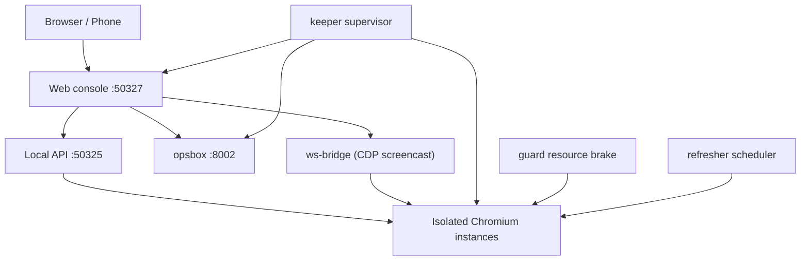

<div align="center">

# changBrowser


-lightgrey)


**Remote web console for isolated Chromium environments**

A self-hosted control plane built on top of [OpenBrowser](https://github.com/sheying2013/OpenBrowser):
manage, watch, and operate many isolated Chromium profiles from a browser, with a
full-chain supervisor (`keeper`), an instance resource guard (`guard`), and an
operations workbench (`opsbox`).

[English](./README.md) | [中文](./README_CN.md)

</div>

---

## Overview

changBrowser keeps the OpenBrowser foundation (isolated Chromium profiles, proxy,
fingerprint, extension and RPA modules) and adds a **remote Web console** so a single
Linux server can run multiple browser environments unattended.

Everything is addressable from a browser:

- **Web console** on port `50327` — instance list, start/stop, real-time browser view,
  tabs and address bar, scheduled reload, proxy library, Chinese operation logs, and an
  embedded (password-less) opsbox.
- **Live view channel** — CDP `Page.startScreencast` bridged over WebSocket. When a
  carrier or gateway blocks the WSS upgrade, the viewer automatically falls back to
  `1s` screenshot polling plus REST commands, and probes WSS again every `15s`.
- **keeper** — a supervisor that keeps Xvfb, the desktop client, the console, opsbox,
  and expected instances alive (revives a dead instance within `15s`, checks CDP health,
  and terminates a runaway instance when the total instance memory approaches the host
  limit).
- **guard** — an emergency resource brake per instance (RSS / CPU / growth / process
  count). It is intentionally set high (`rssLimitMb: 4096`) so it only stops a genuinely
  runaway instance, with day-to-day limits handled by the keeper memory guard.
- **opsbox** — an operations workbench with live CPU / memory / network / disk charts, a
  process table labelled by instance name, memory cleanup, and file management.

> Based on OpenBrowser (MIT). See [Relationship with upstream](#relationship-with-upstream)
> and the [disclaimer](./DISCLAIMER.md).

## Screenshots

| Live view channel | Instance management |
| :---: | :---: |
|  |  |
| Real-time browser frame, tabs, address bar, quality and scheduled reload | Profile list with live status and per-instance actions |

| Operation log | Operations workbench (opsbox) |
| :---: | :---: |
|  |  |
| Freeze/hang events, recovery, exports (Chinese) | CPU / memory / network / disk + process tags |

| Desktop environment management |
| :---: |
|  |
| The Electron client that hosts the Local API |

## Core capabilities

| Area | What it provides |
| --- | --- |
| **Instance management** | List, create, batch-create, import/export, start/stop, delete, groups and search. |
| **Live view channel** | CDP screencast over WebSocket; automatic HTTP-polling fallback; `12s` application heartbeat. |
| **Tabs and navigation** | Multi-tab view, address bar, back/forward, and "reload this page" (frozen or crashed targets are re-navigated to the last known URL). |
| **Render watchdog** | Probes each page every `30s`; a frozen page is unpaused in place to preserve login state, never closed and rebuilt. Forensics are captured to `logs/freeze-forensics.log`. |
| **Scheduled reload** | Window-level config first, instance-level fallback; executed server-side via `Page.reload`, independent of whether the viewer is open; circuit-breaks after 3 consecutive failures. |
| **Proxy library** | HTTP / HTTPS / SOCKS proxies per environment, with egress checks. |
| **Fingerprint** | Platform, language, timezone, UA, Canvas, WebGL, WebRTC, and a random persona generator. |
| **Operation logs** | Chinese operation log, guard events, and refresh-error views. |
| **Operations workbench** | Embedded opsbox over password-less SSO; resource charts and process table. |
| **Full-chain supervisor** | keeper revives Xvfb / client / console / opsbox / expected instances and guards memory. |
| **Resource guard** | guard protects the host from a runaway instance (RSS / CPU / growth / process count). |

## Architecture



| Service | Listen | Description |
| --- | --- | --- |
| Local API | `127.0.0.1:50325` | Built into the desktop client, `api-key` auth. |
| Desktop start page | `127.0.0.1:50326` | Electron launch page, token auth. |
| Web console | `0.0.0.0:50327` | Password login, instance/view/logs/opsbox. |
| opsbox | `0.0.0.0:8002` | Password login, or password-less SSO from the console. |

## Quick start (Ubuntu x86_64)

Requirements: Node.js LTS, Python 3, Xvfb, and the standard Electron/Chromium desktop
libraries.

```bash
# Install dependencies
cd Browserapp
npm ci --include=dev

# Fetch the Electron/Chromium runtime and the Linux kernel
node node_modules/desktop-shell/install.js
npm run prepare:linux-kernel

# Run the console self-test
npm run selftest:webconsole
```

Start the stack. `keeper.js` runs as root and supervises every component, including
`Xvfb :99`, the desktop client, the console (`50327`) and opsbox (`8002`):

```bash
# Supervisor (root). It starts and revives the rest.
node Browserapp/webconsole/keeper.js
```

The desktop client refuses to run as root and must be launched as the desktop user:

```bash
setpriv --reuid=1000 --regid=1000 --clear-groups \
  env HOME=/home/openbrowser USER=openbrowser LOGNAME=openbrowser DISPLAY=:99 \
  ELECTRON_DISABLE_SANDBOX=1 node Browserapp/scripts/run-app.js
```

## Project layout

```text
changBrowser/
├── Browserapp/
│   ├── engine.js                 # Instance launch and Chromium argument assembly
│   ├── main.js                   # Electron main process
│   ├── automation/               # Local API and RPA
│   └── webconsole/
│       ├── server.js             # Web console HTTP/WS server (:50327)
│       ├── keeper.js             # Full-chain supervisor
│       ├── guard.js              # Per-instance resource brake
│       ├── refresher.js          # Scheduled reload scheduler
│       ├── ws-bridge.js          # Zero-dependency CDP screencast WS bridge
│       ├── fingerprint.js        # Random persona generator
│       └── public/index.html     # Console UI
├── opsbox/
│   ├── app.py                    # Operations workbench (FastAPI, :8002)
│   └── index.html                # opsbox UI
├── docs/screenshots/             # Screenshots
├── DISCLAIMER.md
├── LICENSE
└── README.md / README_CN.md
```

The repository contains source and documentation only. It does not include profiles,
cookies, proxy credentials, bundled kernel binaries, or installers.

## Data and security

- The Local API binds to loopback only; if `OPENBROWSER_API_KEY` is set, requests must
  carry the `api-key` header.
- Console and opsbox passwords come from `CONSOLE_PASSWORD` / `OPS_PASSWORD`, or from
  `<userData>/console-password.txt`. They are never committed.
- The Web console and opsbox listen on `0.0.0.0` for remote access; protect them with a
  strong password. Logins are rate-limited.
- Runtime logs live under `<userData>/logs/` (`console-ops.log`, guard events,
  `freeze-forensics.log`, `refresh-errors.log`).
- Cloud backup integrations only connect outbound after explicit user configuration.

## Relationship with upstream

changBrowser is a downstream customization of
[OpenBrowser](https://github.com/sheying2013/OpenBrowser). The desktop application,
kernel management, fingerprint and proxy modules come from upstream; the remote Web
console, the live view channel, `keeper`, `guard`, `refresher`, `ws-bridge` and `opsbox`
are additions in this repository.

## License

[MIT](./LICENSE). OpenBrowser and its bundled notices are documented in
[`Browserapp/THIRD-PARTY-NOTICES.md`](./Browserapp/THIRD-PARTY-NOTICES.md).
