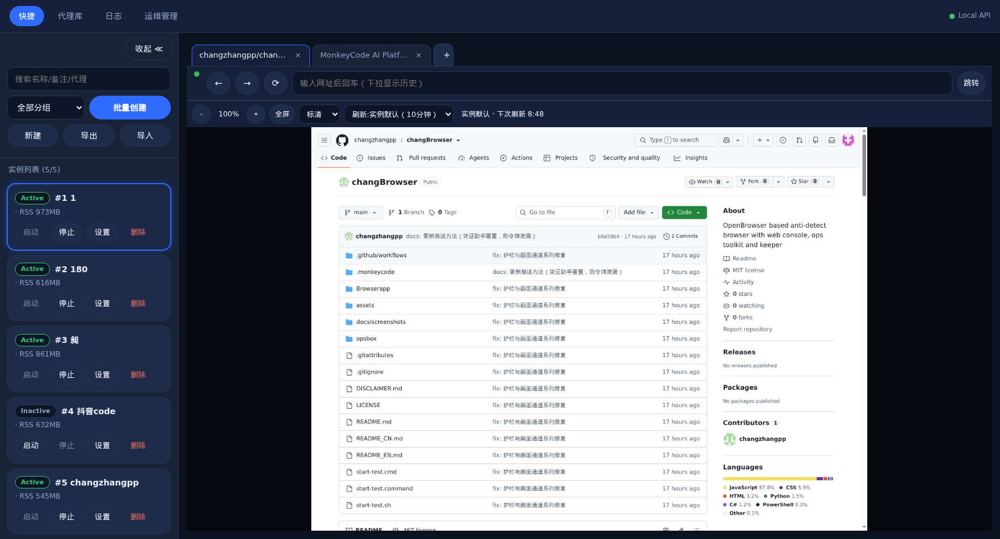
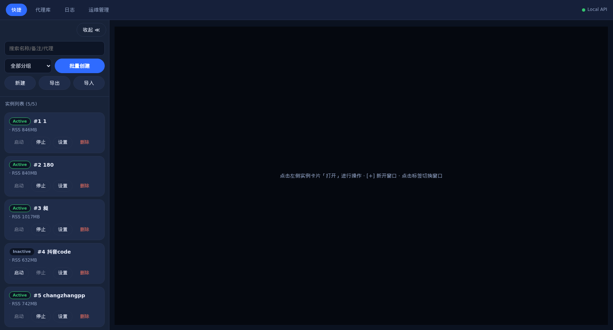
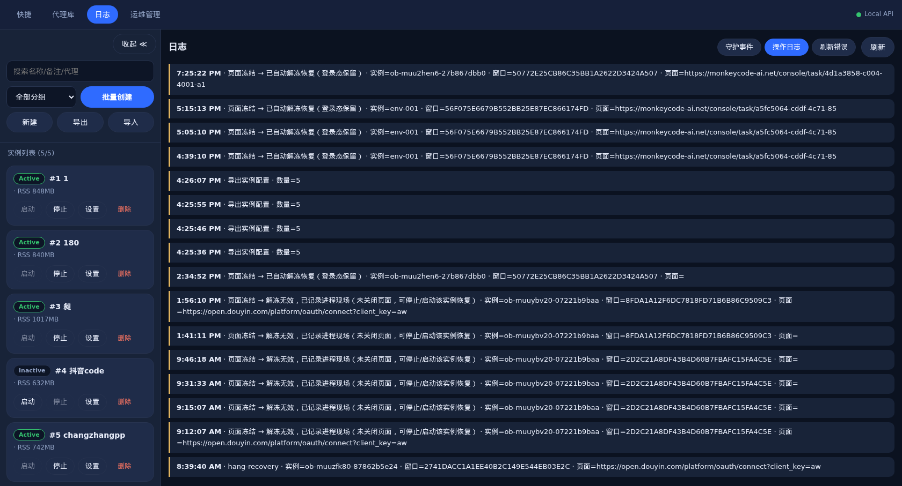
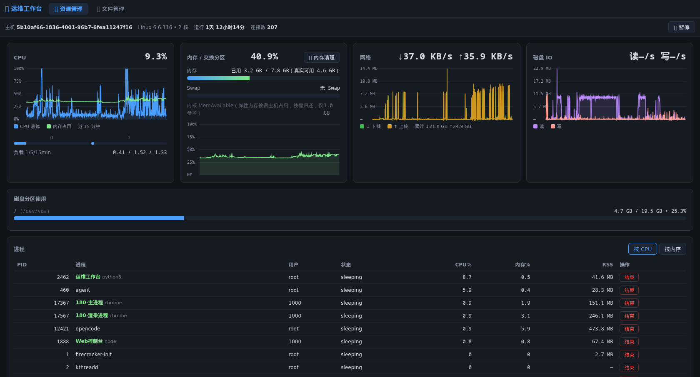
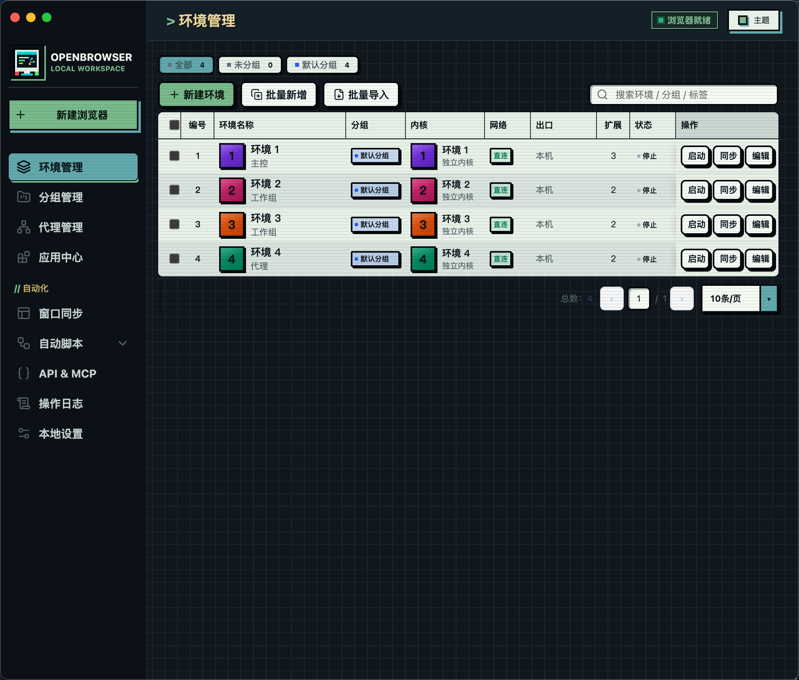
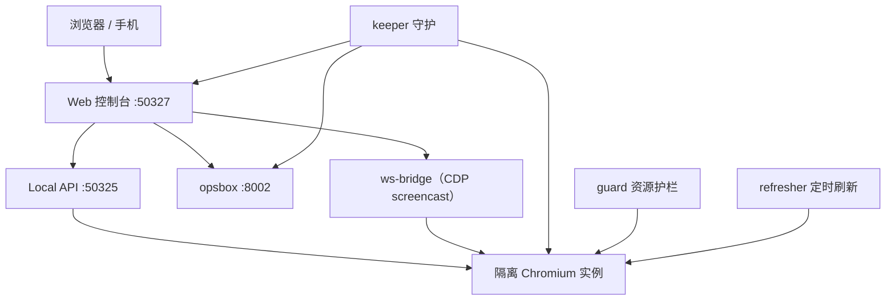

<div align="center">

# changBrowser


-lightgrey)


**面向隔离 Chromium 环境的远程 Web 控制台**

基于 [OpenBrowser](https://github.com/sheying2013/OpenBrowser) 构建的自托管控制面：
在浏览器里集中管理、实时查看并操作多套隔离的 Chromium 实例，配套全链路守护
`keeper`、实例资源护栏 `guard` 与运维工作台 `opsbox`。

[English](./README.md) | [中文](./README_CN.md)

</div>

---

## 简介

changBrowser 保留 OpenBrowser 的底座（隔离 Chromium Profile、代理、指纹、扩展与
RPA 模块），并在此基础上增加了一个**远程 Web 控制台**，让一台 Linux 服务器可以
无人值守地运行多套浏览器环境。

全部操作都可以在浏览器里完成：

- **Web 控制台**（端口 `50327`）——实例列表、启停、实时画面、多标签与地址栏、定时刷新、
  代理库、中文操作日志，以及免密嵌入的 opsbox。
- **画面通道**——通过 WebSocket 桥接 CDP `Page.startScreencast`。当运营商或网关拦截
  WSS 升级时，查看器自动降级为 `1s` 轮询截图 + REST 指令，并每 `15s` 试探 WSS 自动切回。
- **keeper**——全链路守护：让 Xvfb、桌面客户端、控制台、opsbox 与期望实例存活
  （实例死亡 `15s` 内复活，检测 CDP 健康，实例内存总和逼近主机上限时终止失控实例）。
- **guard**——按实例的应急资源刹车（RSS / CPU / 增速 / 进程数）。阈值刻意设高
  （`rssLimitMb: 4096`），只强停真正失控的实例，日常上限由 keeper 内存守护承担。
- **opsbox**——运维工作台：CPU / 内存 / 网络 / 磁盘实时曲线、按实例名标注的进程表、
  内存清理与文件管理。

> 基于 OpenBrowser（MIT）。参见 [与上游的关系](#与上游的关系) 与 [免责声明](./DISCLAIMER.md)。

## 界面预览

| 画面通道 | 实例管理 |
| :---: | :---: |
|  |  |
| 实时浏览器画面、多标签、地址栏、画质与定时刷新 | Profile 列表、实时状态、单实例操作 |

| 操作日志 | 运维工作台（opsbox） |
| :---: | :---: |
|  |  |
| 页面冻结 / 解冻、恢复、导出等事件（中文） | CPU / 内存 / 网络 / 磁盘曲线与进程标签 |

| 桌面端 · 环境管理 |
| :---: |
|  |
| 承载 Local API 的 Electron 客户端 |

## 核心能力

| 模块 | 能力 |
| --- | --- |
| **实例管理** | 列表、新建、批量创建、导入 / 导出、启停、删除、分组与搜索。 |
| **画面通道** | CDP screencast over WebSocket；HTTP 轮询自动兜底；`12s` 应用层心跳。 |
| **标签与导航** | 多标签查看、地址栏、前进后退，以及「刷新此页」（冻结或崩溃目标按上次已知 URL 重新导航）。 |
| **渲染看门狗** | 每 `30s` 探测各页面；冻结页面原地解冻以保留登录态，绝不关页重建；现场写入 `logs/freeze-forensics.log`。 |
| **定时刷新** | 窗口级配置优先、实例级兜底；服务端 `Page.reload` 执行，与查看器是否打开无关；连续失败 3 次熔断。 |
| **代理库** | 按环境绑定 HTTP / HTTPS / SOCKS 代理，支持出口检测。 |
| **指纹参数** | 平台、语言、时区、UA、Canvas、WebGL、WebRTC，以及随机人设生成。 |
| **操作日志** | 中文操作日志、守护事件与刷新错误视图。 |
| **运维工作台** | 免密 SSO 嵌入 opsbox；资源曲线与进程表。 |
| **全链路守护** | keeper 复活 Xvfb / 客户端 / 控制台 / opsbox / 期望实例，并做内存守护。 |
| **资源护栏** | guard 防止单个实例拖垮主机（RSS / CPU / 增速 / 进程数）。 |

## 架构



| 服务 | 监听 | 说明 |
| --- | --- | --- |
| Local API | `127.0.0.1:50325` | 桌面客户端内置，`api-key` 认证。 |
| 桌面启动页 | `127.0.0.1:50326` | Electron 启动页，token 认证。 |
| Web 控制台 | `0.0.0.0:50327` | 口令登录，实例 / 画面 / 日志 / 运维管理。 |
| opsbox | `0.0.0.0:8002` | 口令登录，或由控制台免密 SSO。 |

## 快速开始（Ubuntu x86_64）

依赖：Node.js LTS、Python 3、Xvfb，以及标准 Electron / Chromium 桌面库。

```bash
# 安装依赖
cd Browserapp
npm ci --include=dev

# 获取 Electron / Chromium 运行时与 Linux 内核
node node_modules/desktop-shell/install.js
npm run prepare:linux-kernel

# 运行控制台自测
npm run selftest:webconsole
```

启动整套服务。`keeper.js` 以 root 运行，负责守护包括 `Xvfb :99`、桌面客户端、
控制台（`50327`）与 opsbox（`8002`）在内的所有组件：

```bash
# 守护进程（root）。它会拉起并复活其余组件。
node Browserapp/webconsole/keeper.js
```

桌面客户端拒绝以 root 运行，必须以桌面用户启动：

```bash
setpriv --reuid=1000 --regid=1000 --clear-groups \
  env HOME=/home/openbrowser USER=openbrowser LOGNAME=openbrowser DISPLAY=:99 \
  ELECTRON_DISABLE_SANDBOX=1 node Browserapp/scripts/run-app.js
```

## 项目结构

```text
changBrowser/
├── Browserapp/
│   ├── engine.js                 # 实例启动与 Chromium 参数组装
│   ├── main.js                   # Electron 主进程
│   ├── automation/               # Local API 与 RPA
│   └── webconsole/
│       ├── server.js             # Web 控制台 HTTP/WS 服务（:50327）
│       ├── keeper.js             # 全链路守护
│       ├── guard.js              # 单实例资源护栏
│       ├── refresher.js          # 定时刷新调度器
│       ├── ws-bridge.js          # 零依赖 CDP screencast WS 桥
│       ├── fingerprint.js        # 随机指纹人设生成器
│       └── public/index.html     # 控制台界面
├── opsbox/
│   ├── app.py                    # 运维工作台（FastAPI，:8002）
│   └── index.html                # opsbox 界面
├── docs/screenshots/             # 截图
├── DISCLAIMER.md
├── LICENSE
└── README.md / README_CN.md
```

仓库只包含源码与文档，不包含 Profile、Cookie、代理凭据、打包用内核二进制或安装包。

## 数据与安全

- Local API 仅监听回环；设置 `OPENBROWSER_API_KEY` 后请求必须携带 `api-key` 头。
- 控制台与 opsbox 口令来自 `CONSOLE_PASSWORD` / `OPS_PASSWORD`，或
  `<userData>/console-password.txt`，不写入仓库。
- Web 控制台与 opsbox 监听 `0.0.0.0` 供远程访问，请使用强口令保护；登录已做失败限流。
- 运行日志位于 `<userData>/logs/`（`console-ops.log`、守护事件、`freeze-forensics.log`、
  `refresh-errors.log`）。
- 云备份集成只有在用户显式配置后才会主动联网。

## 与上游的关系

changBrowser 是 [OpenBrowser](https://github.com/sheying2013/OpenBrowser) 的下游定制。
桌面应用、内核管理、指纹与代理模块来自上游；远程 Web 控制台、画面通道、`keeper`、
`guard`、`refresher`、`ws-bridge` 与 `opsbox` 为本仓库新增。

## 许可证

[MIT](./LICENSE)。OpenBrowser 及其第三方声明见
[`Browserapp/THIRD-PARTY-NOTICES.md`](./Browserapp/THIRD-PARTY-NOTICES.md)。
